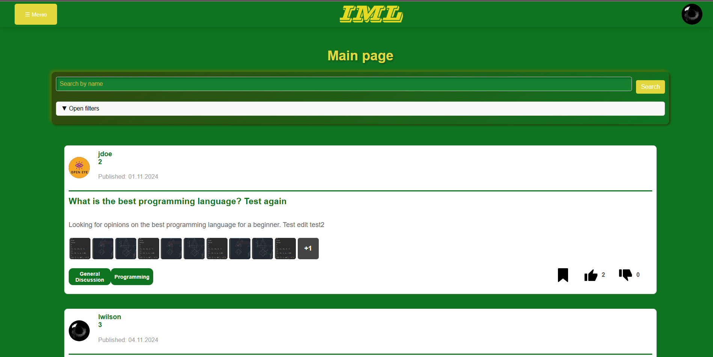
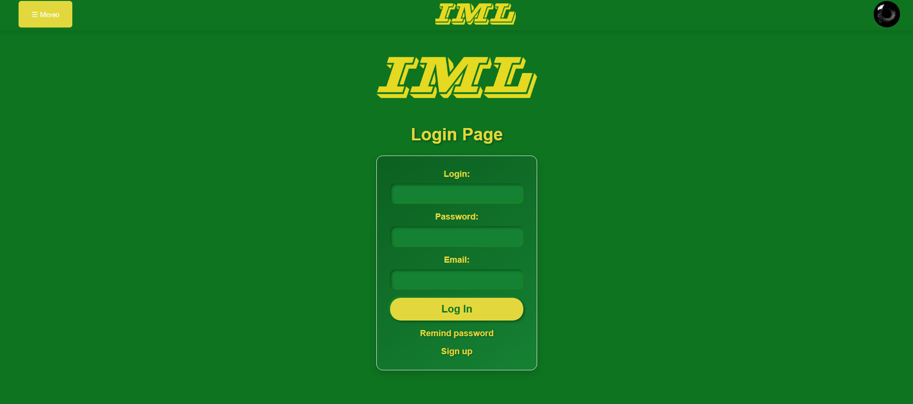
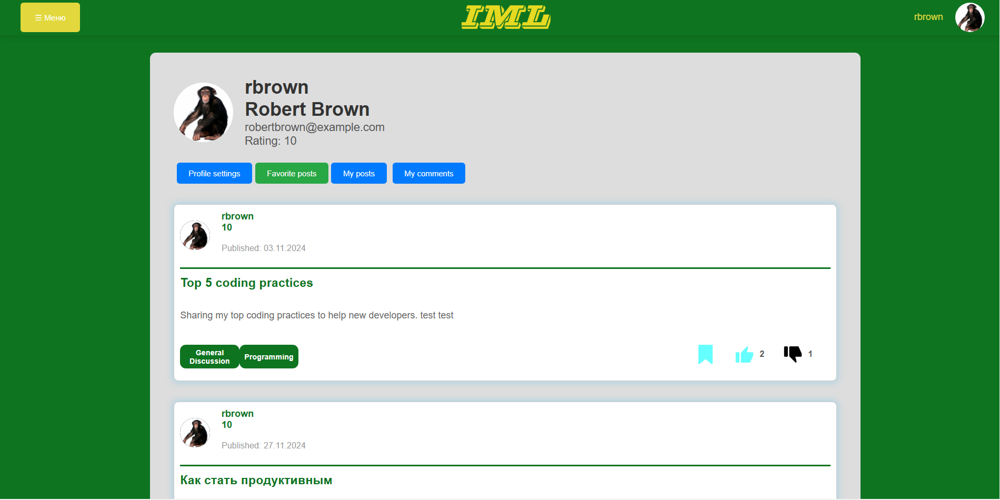
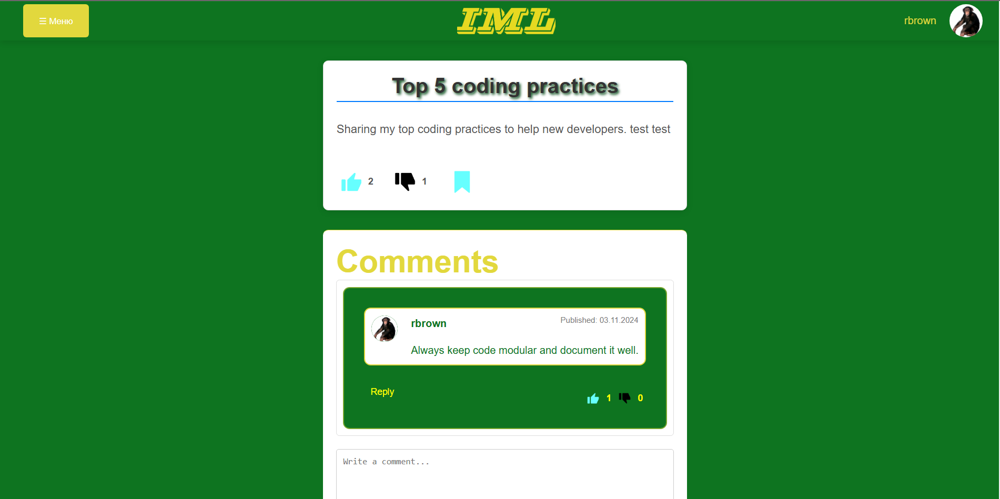
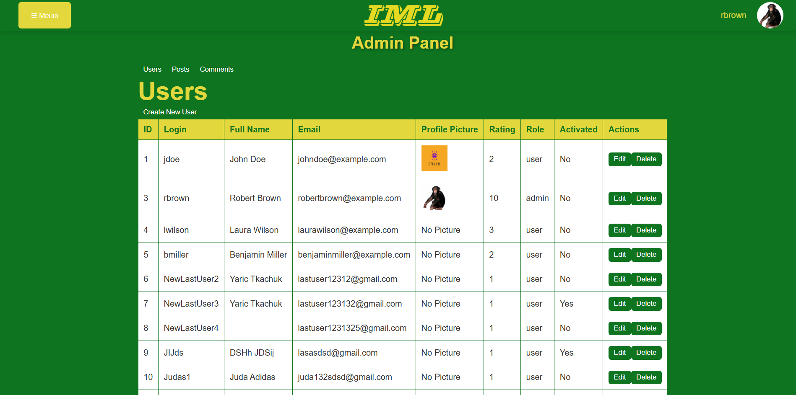

# usof-Front

The project implements a user profile page with the ability to view posts, comments, favorite posts and edit the profile. The user can view, edit and delete his posts and comments. It is also possible to view your rating and profile settings.

# Getting Started with Create React App
This project was bootstrapped with [Create React App.](https://github.com/facebook/create-react-app)

# Available Scripts
## In the project directory, you can run:

# Requirements and dependencies:
```json
{
  "name": "usof-frontend",
  "version": "0.1.0",
  "private": true,
  "dependencies": {
    "@reduxjs/toolkit": "^2.3.0",
    "@testing-library/jest-dom": "^5.17.0",
    "@testing-library/react": "^13.4.0",
    "@testing-library/user-event": "^13.5.0",
    "axios": "^1.7.7",
    "formik": "^2.4.6",
    "framer-motion": "^11.11.17",
    "moment": "^2.30.1",
    "react": "^18.3.1",
    "react-dom": "^18.3.1",
    "react-hot-toast": "^2.4.1",
    "react-infinite-scroll-component": "^6.1.0",
    "react-modal": "^3.16.1",
    "react-redux": "^9.1.2",
    "react-router-dom": "^6.28.0",
    "react-scripts": "5.0.1",
    "react-toastify": "^10.0.6",
    "redux-persist": "^6.0.0",
    "web-vitals": "^2.1.4",
    "yup": "^1.4.0"
  },
  "scripts": {
    "start": "react-scripts start",
    "build": "react-scripts build",
    "test": "react-scripts test",
    "eject": "react-scripts eject"
  },
  "eslintConfig": {
    "extends": [
      "react-app",
      "react-app/jest"
    ]
  },
  "browserslist": {
    "production": [
      ">0.2%",
      "not dead",
      "not op_mini all"
    ],
    "development": [
      "last 1 chrome version",
      "last 1 firefox version",
      "last 1 safari version"
    ]
  }
}
```

## 1.Clone this repository:

    git clone git@gitlab.ucode.world:connect-khpi/connect-fullstack-usof-backend/mhrytsenko.git
    cd usof-backend

## 2.Install dependencies:

    npm install

# Start react app<br>

    -npm start

The app will start on http://localhost:3000.

# Additional notes
When a user is authorized, it is checked whether they are in the system. If not, the user is redirected to the login page.
Components are used to handle errors, such as toast messages to display successful or failed operations.

# Screenshots of the project 

# Main page


# Login page


# User page


# Post page
 

# Admin page
